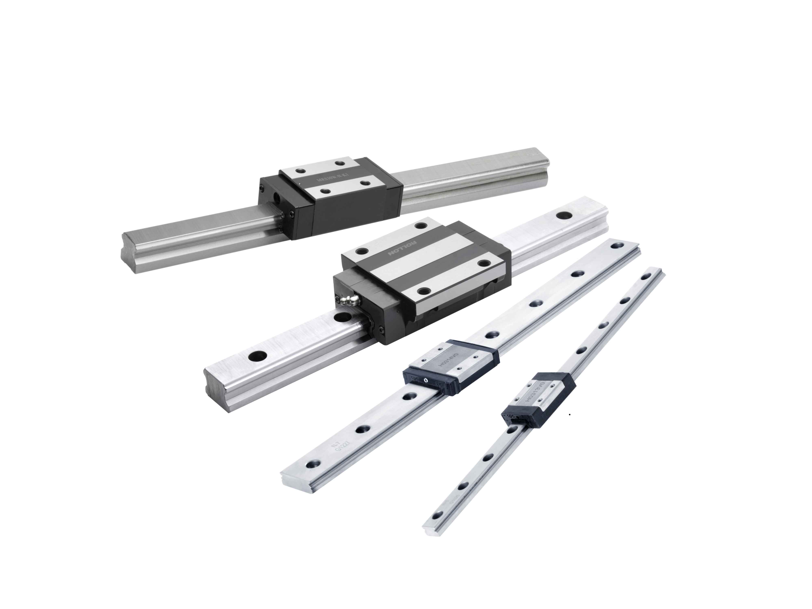
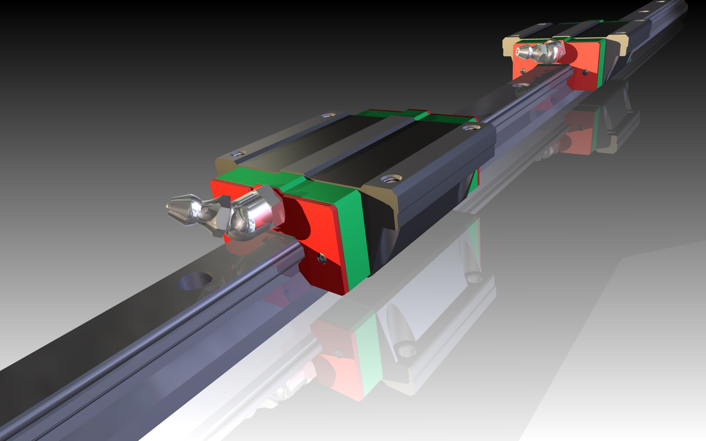
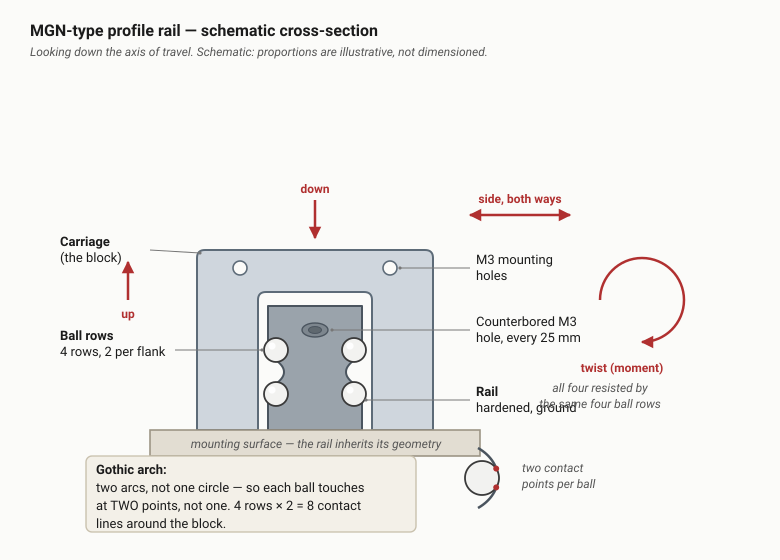
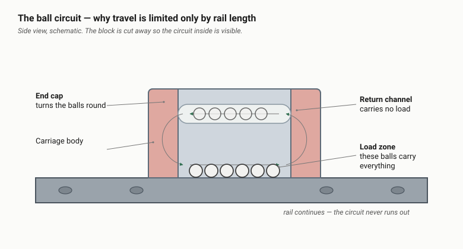
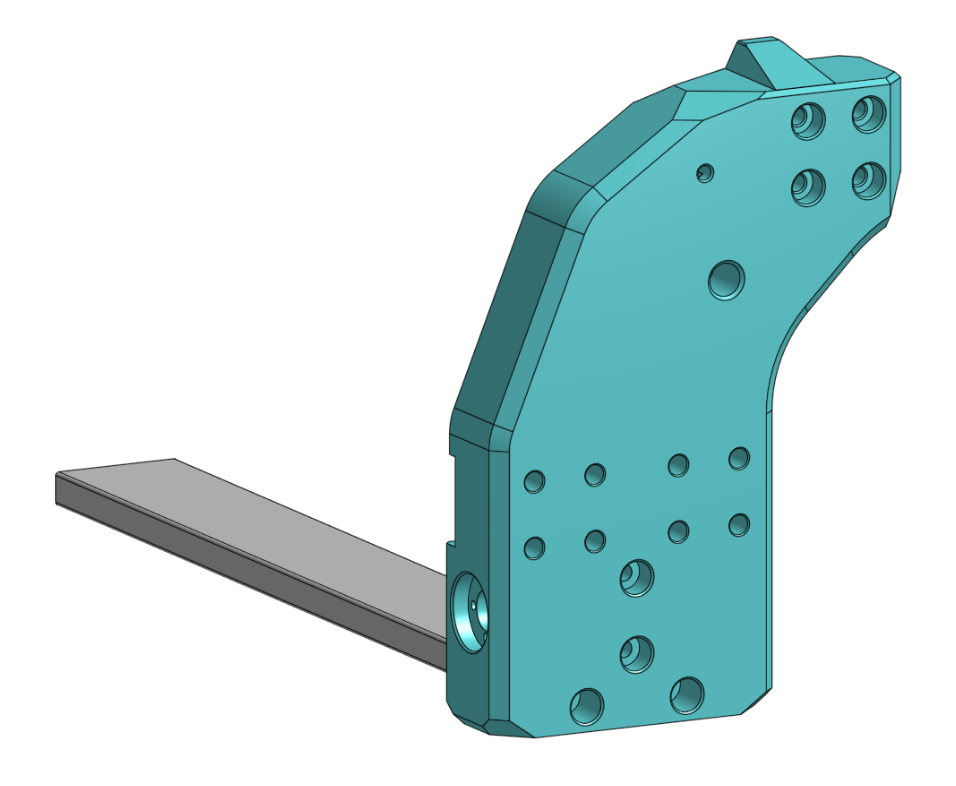

# MGN12 rails, from scratch

If you've landed here because "MGN12H" keeps appearing in the parts list and
you'd like to know what you're buying, this is for you. No prior knowledge of
linear motion assumed.

**What this project is:** an Ender 3 3D printer converted into a small CNC
router - a machine that holds a spinning cutter and moves it through wood,
plastic or aluminium to carve a shape. The conversion replaces the printer's
motion system with linear rails, and this document explains what those are and
why the swap is the whole point of the build.

If you already know what a recirculating ball guide is, start at
[section 5](#5-why-this-build-is-named-after-the-rails).

---

## Definitions

Skim this, then refer back. Terms are grouped by where they come from.

### Words that mean something different here than in 3D printing

| Term | In this document |
|---|---|
| **Extrusion** | An aluminium bar with T-shaped slots down its faces, used as structural framing - the silver beams your printer's frame is made of. **Not** plastic coming out of a nozzle. "2020 extrusion" means a 20 × 20 mm one. |
| **Ground** | Machined to a precise finish by an abrasive wheel. "Ground steel" means steel finished to high accuracy. Nothing to do with electrical earth. |
| **Hardened** | Heat-treated so the surface resists wear and denting. |
| **Chips / swarf** | The same thing: the small fragments of material a cutter throws off. Wood makes dust, aluminium makes sharp curls. |

### Linear motion

| Term | Meaning |
|---|---|
| **Profile rail** | The general category MGN belongs to: a ground steel rail with a ball-bearing carriage running on it. |
| **Carriage / block** | The moving part that rides the rail. The two words are used interchangeably. |
| **Recirculating** | The balls travel in a closed loop through the block, so how far you can travel depends on the rail, not the bearing. |
| **Gothic arch** | The groove shape - two arcs rather than one semicircle - which gives two contact points per ball. |
| **Preload** | A deliberate internal squeeze on the balls, fitted at the factory. Trades a little friction for no play and more stiffness. |
| **Backlash** | Lost motion when you reverse direction: the slack that has to be taken up before anything actually moves. |
| **Stiffness** | How much force it takes to deflect something by a given amount. Measured here in newtons per micron (N/µm) - higher is stiffer. |
| **Dummy rail** | The plastic stub a carriage is shipped on, which stops the balls falling out. |
| **V-wheel** | The stock Ender motion system: grooved plastic wheels running in the V-shaped slot of the extrusion. |
| **Eccentric nut** | A nut whose hole is off-centre, so turning it moves the wheel slightly closer to or further from the rail. This is how V-wheel play is adjusted out. |

### Machining and CNC

| Term | Meaning |
|---|---|
| **CNC** | Computer Numerical Control - the machine is driven by a program rather than by hand. Your 3D printer is already a CNC machine; this one cuts instead of printing. |
| **Router / mill** | A machine that removes material with a spinning cutter. A router spins fast and takes light cuts; a mill spins slower and takes heavier ones. This build is a router. |
| **Spindle** | The motor-and-holder that grips the cutter and spins it. The CNC equivalent of a printer's hotend. |
| **Endmill / cutter** | The cutting tool itself - like a drill bit, but it cuts on its sides as well as its tip. |
| **Flute** | One of the cutting edges spiralling up an endmill. A 2-flute cutter takes two bites per revolution, so at 15,000 rpm that's 500 impacts a second. |
| **Climb milling** | Cutting in the direction the cutter is already pulling. It gives a better finish but tries to drag the machine into the work, so it needs a rigid machine. |
| **Chatter** | Vibration that feeds itself: the tool deflects, springs back, bites again. Leaves a rippled surface and sounds awful. |
| **Gantry** | The moving bridge that carries the tool across the work. On your printer, the beam the hotend rides on. |
| **Tram** | To square the machine up - getting the spindle truly perpendicular to the bed. |
| **Moment / couple** | A twisting force rather than a straight push. A spindle sticking out on an arm turns a sideways push into a twist on whatever holds it. A "couple" is two opposed forces producing that twist, which is what two spaced-apart carriages provide. |

### Fasteners and shop terms

| Term | Meaning |
|---|---|
| **M3** | A metric screw 3 mm in diameter. **M5** is 5 mm. |
| **Counterbore** | A flat-bottomed widening at the top of a screw hole, so the screw head sits flush or below the surface rather than sticking up. |
| **Heat-set insert** | A brass threaded sleeve melted into a 3D-printed part so it can take a metal screw repeatedly. |
| **BOM** | Bill of Materials - the full parts list for a build. |
| **kN** | Kilonewton, a unit of force. 1 kN is roughly the weight of 100 kg. So a 3.92 kN static rating is about 400 kg of load before permanent damage. |
| **N·m / N·cm** | Newton-metre and newton-centimetre: units of torque, i.e. twisting force. 1 N·m is about the torque of a firm turn with a small screwdriver. |
| **µm** | Micron - one thousandth of a millimetre. |

---

## 1. What one is

An MGN12 rail is a hardened steel bar with precision-ground grooves down both
sides, and a **carriage** that rides along it on recirculating ball bearings.
The carriage slides freely along the rail and won't move measurably in any
other direction.

That's the whole product: it can slide along the rail, and it can do nothing
else. Everything in this document is a consequence of that.

*Profile rail guides in four sizes. The two at the right are miniature rails of
the same family as MGN12; the two at the left are larger industrial series. The
architecture is identical at every size - only the width changes.
Photo: Rollon91, [Wikimedia Commons](https://commons.wikimedia.org/wiki/File:Mono_Rail.jpg), CC BY-SA 3.0.*

---

## 2. Reading the part number

`MGN12H` is three pieces of information joined together.

| Piece | Means |
|---|---|
| **MGN** | Miniature Guide, Narrow - the compact profile-rail family. There is a matching MGW "wide" family, which this build doesn't use. |
| **12** | The rail is **12 mm wide**. That's all the number means. MGN9 is 9 mm, MGN15 is 15 mm. It's not a length, a load rating, or a bore. |
| **H** or **C** | The carriage body length. **C** is the short standard block, **H** is the long one - more balls in contact, so higher load capacity and more resistance to twisting. Both use the same rail and sit at the same height above it. |

Length is quoted separately, in millimetres, because rail gets cut to order.
"MGN12H, 300 mm" means a 300 mm rail with the long carriage.

### The full designation

HIWIN's own part numbers carry more than this. The order of the fields is what
tells them apart:

A full HIWIN part number reads `MGN 12 C E 2 R1600 E Z1 P M`, which unpacks
left to right as:

| Field | Example | Means |
|---|---|---|
| Series | `MGN` | Miniature, narrow |
| Size | `12` | Rail width in mm |
| Block type | `C` | `C` = standard, `H` = long |
| Block option | `E` | Special block; omitted for a standard one |
| Blocks per rail | `2` | How many carriages on this rail |
| Rail length | `R1600` | Millimetres |
| Rail option | `E` | Special rail; omitted for a standard one |
| **Preload class** | `Z1` | `ZF`, `Z0` or `Z1` - see below |
| **Precision grade** | `P` | `C`, `H` or `P` |
| Material | `M` | Omitted = carbon steel, `M` = stainless |

**The letter `H` appears twice in this scheme and means two different things.**
In the block-type position it means a long block. In the precision position it
means "high" grade. So `MGN12H...H` is not a typo - it's a long block in high
precision. Position is the only thing that distinguishes them. This catches
people out constantly.

**Preload classes**, which decide how much internal squeeze the balls have:

| Code | Class | What it actually is |
|---|---|---|
| `ZF` | Light clearance | 4-10 µm of *clearance* - i.e. actual play. Avoid for a cutting machine. |
| `Z0` | Very light preload | Zero clearance, no meaningful preload. |
| `Z1` | Light preload | Preloaded to 2% of the dynamic load rating. Stiffest of the three. |

The difference is not small. On an MGN12C, HIWIN quotes radial stiffness of
44 N/µm at `Z0` and 105 N/µm at `Z1` - the light-preload block is about 2.4
times stiffer. See [section 4.2](#42-preload-converts-clearance-into-stiffness).

**Precision grades** are `C` (normal), `H` (high) and `P` (precision), in that
order of increasing accuracy and cost.

### Two things that trip up ordering

**"MGN12H rail" isn't really a thing.** `C` and `H` describe the *block*, not
the rail. HIWIN's rails have their own designation (`MGNR12`, with no C or H in
it) because any MGN12 rail takes any MGN12 block. When a seller or a parts list
says "MGN12H linear rail", they mean "a rail to suit an MGN12 block", and
usually they mean it's supplied with an H block. Both this project's
[BOM](../BOM.md) and Chauk's remix use the phrase that way.

**Check what's actually in the box.** "MGN12H 300mm" might be rail only, rail
plus one carriage, or rail plus two, and the seller won't always say. That's
why the parts lists here count carriages and rails separately - Chauk's remix
asks for 6 MGN12C and 6 MGN12H carriages, quite apart from the rails they ride
on.

---

## 3. What's inside one

*A profile rail with two carriages. The coloured parts at each end of the block
are the end caps and seals; the chrome fittings are grease nipples. The
counterbored holes along the rail take the mounting screws. This is a larger
series than MGN12, but the construction is the same.
Render: Zdenek Vlasic, [Wikimedia Commons](https://commons.wikimedia.org/wiki/File:Linear_Bearing_Guide_way.jpg), CC BY-SA 3.0.*

An assembly is made of:

- **The rail** - hardened steel, ground flat on the bottom, with one precision
  groove down each side running its full length. Counterbored holes along the
  top take M3 screws every 25 mm.
- **The carriage body** - a steel block with matching internal grooves.
- **Ball bearings** in four rows. Each of the rail's two grooves carries two
  rows, one above the other. These carry all the load.
- **End caps** at both ends of the carriage, each containing a return channel.
- **Seals** to keep dirt out, and on better blocks a grease nipple.

Genuine HIWIN rails also ship with small plastic **caps** that press into the
rail's counterbores after mounting, so chips can't collect in the screw holes.
For MGN12 they're 6.15 mm across and 1.2 mm thick.

### The groove profile

The grooves aren't simple semicircles. They're ground as a **gothic arch** -
two arcs meeting at a slight point - so each ball touches its groove at two
points instead of one. Four rows of balls, two contacts each, gives you eight
contact lines spread around the block. That's how something this small resists
being pushed down, pulled up, shoved sideways and twisted, all at once.

*Schematic cross-section - it shows how the parts relate, not what size they
are. Don't scale dimensions off it; the real figures are in
[section 10](#10-specifications).*

### The ball circuit

The balls don't just sit in the block, they go round and round. A ball rolls
along the loaded zone at the bottom, reaches the end, and the end cap scoops it
into a return channel that runs back through the body carrying no load. At the
far end it gets turned around again and rejoins the loaded zone.

Since the loop never ends, travel is limited by the rail and nothing else. A
300 mm rail and a 1000 mm rail use the same carriage.

*Schematic side view, block cut away. Again, relationships not dimensions.*

---

## 4. Why they work

Four ideas do most of the work.

### 4.1 Rolling instead of sliding

A ball in a groove squashes very slightly over a contact patch about the size
of a pinhead, and rolls. Nothing slides, nothing wears a face, nothing sticks
then lets go. Friction works out to a few parts per thousand of the load, and
more to the point it's **constant** - the shove needed to get moving is about
the same as the shove needed to keep moving.

The consistency matters more than the low number. A machine whose friction
changes depending on where it is or which way it's going has its motion control
chasing a target that keeps moving, and you see the result in the cut wherever
an axis reverses.

### 4.2 Preload converts clearance into stiffness

At the factory the block is built with balls very slightly oversized for the
gap, so every ball is already squeezed before you apply any load at all. You
don't do this yourself and you can't adjust it - you choose it when you order,
via the preload class. Two things follow from it:

1. **No backlash.** Reverse direction and the carriage moves right away,
   because there's no gap to cross first. On a mill, backlash is the difference
   between a circle and a circle with flats where the axes changed direction.
2. **More stiffness.** A preloaded block resists deflection harder. HIWIN's
   own numbers for an MGN12C: 44 N/µm with very light preload (`Z0`), 105 N/µm
   with light preload (`Z1`). The MGN12H goes from 70 to 175 N/µm the same way.

You pay for it in friction, heat, and a much lower tolerance for a mounting
surface that isn't flat. That's why preload comes in classes instead of being
cranked up as far as it'll go.

### 4.3 The rail defines the straight line

This is the one people miss. A linear guide doesn't just allow motion along a
line - it *is* the line. The ground rail is the most accurate object in the
whole machine, and your gantry inherits its geometry.

It inherits whatever's under the rail, too. A 12 mm rail is a stiff bar, but
bolt it down every 25 mm to a piece of extrusion with a bow in it and the rail
will be pulled into that bow, and the carriage will trace the bow all day
without complaint. The accuracy isn't free. You get as much of it as the
surface underneath has earned.

That's the real shift in thinking from V-wheels. V-wheels forgive a mediocre
surface, because the wheels have a bit of give and the eccentric nuts let you
dial the error out. A rail has almost no give and nothing to adjust, so it
doesn't hide your mistakes - it repeats them, accurately, forever.

### 4.4 Stiffness, not strength

On a hobby CNC, the part that ruins your day almost never breaks. It **moves** -
deflects under cutting load, springs back, and does it again a few hundred
times a second. That's chatter, and it's the difference between a finished
surface and a chewed one.

So the number that matters is stiffness - force per unit of deflection - not
strength, which is force before something snaps. Rails beat V-wheels on
stiffness by a wide margin, and by a wider one on resisting twist. Two blocks
spaced apart on a single rail act as a couple against the tipping moment a
side-loaded spindle applies, which makes that spacing worth as much thought as
which block you buy.

---

## 5. Why this build is named after the rails

A stock Ender 3 runs on **V-wheels**: polycarbonate wheels with a 90-degree
groove, rolling in the V of the extrusion, with one eccentric nut per carriage
to take up play.

For a 3D printer that's a perfectly good design. The loads are small and point
more or less downward - a light toolhead, plus whatever pushing back the
extruder does.

Milling doesn't play by those rules. A cutter pushes sideways and upward as
well as down, and it changes its mind with every flute - a two-flute cutter at
15,000 rpm reverses its load 500 times a second. The spindle hangs off the
front of the Z plate on a lever arm, so every one of those pushes arrives as a
twist as well. Against all of that, a V-wheel offers a plastic wheel and a nut
held in place by friction.

Five things go wrong, and they compound:

| V-wheel limitation | Effect on the cut |
|---|---|
| Polycarbonate deflects far more than steel under the same load | The tool walks off the intended path |
| Point contact on the extrusion's V | High local stress, so the V wears and the machine gets looser over time |
| Eccentric nuts drift out of adjustment | Needs periodic re-tensioning to take the play back out |
| Weak against uplift and twist | Climb milling can lift the gantry; chatter marks |
| Open bearings in a chip-filled environment | Aluminium swarf embeds in the plastic and abrades the extrusion |

Rails answer all five: steel instead of plastic, conforming contact instead of a
point, permanent preload instead of one you have to keep adjusting, similar
load capacity whichever way you push, and seals over a closed ball circuit to
keep the chips out.

Which is why this is the mod the build is named after, rather than one upgrade
among several. Swapping the motion system changes the machine's reference
geometry, so every carriage, gantry plate, corner block and endstop position
has to be redesigned around it. You can't bolt it onto a stock CNC conversion
afterwards. It needs its own printed-parts set and its own
[bill of materials](../BOM.md), and everything else in the build follows from
this one decision.

*One of the mod's printed parts. The short length of rail at the lower left is
there to show the fit - the whole part is shaped around the rail and its
carriage. This is what "the rails set the machine's reference geometry" means
in practice.
Source: `cnc3_mgn_mod_version-3` parts screenshots, held in this repository's
[`images/`](../images/) folder.*

### Which version of this build?

Worth knowing before you buy anything, because the parts lists differ. There
are three documented variants in this repository:

| Variant | Drive | Parts list |
|---|---|---|
| **Belted** | GT2 belts and pulleys | [`BOM.md`](../BOM.md) - the whole-machine list |
| **Leadscrew** | Threaded rod with anti-backlash nuts | [inventory](../previous-build-inventories/E3CNC_MGN12H_LEADS-inventory.md) of the BETA CAD's `E3CNC_MGN12H_LEADS` branch |
| **Chauk's remix** | Threaded rod, 350 mm rails | [reference note](printables-chauk-e3cnc-mgn-mod.md) - downstream remix, its own geometry |

All three use MGN12, but the counts don't match. The leadscrew CAD branch
places 10 MGN12H carriages and 2 MGN12C slide blocks; Chauk's remix calls for 6
of each. Which one this shop is building has not been decided yet - see
[section 11](#11-open-questions).

---

## 6. What they cost you

The honest list, because none of the above is free.

- **Price.** Rails and carriages are usually the biggest line in the BOM, and
  the carriages often cost more than the rail they run on.
- **They need a good surface to sit on.** Money spent on rails bolted to a
  twisted frame doesn't buy accuracy, it buys a very repeatable error.
- **Dirt is the enemy.** A ball circuit that swallows a chip is damaged, not
  dirty. Wipers, covers, the little hole caps and keeping swarf off the rails
  all come with the territory.
- **Nothing adjusts.** There's no eccentric nut to save you. Alignment lives
  entirely in the parts and in how you tighten the screws.
- **Parallel rails have to actually be parallel.** Two rails carrying one
  gantry will fight each other otherwise, and it's a quiet fight - stiffness,
  heat and early wear, not an obvious fault you can point at.
- **They need grease.** They're bearings. Run one dry and the balls and grooves
  wear rapidly, it gets noisy, and then it develops play - which is the one
  thing you bought it to avoid.

---

## 7. Handling

One mistake gets its own line, because nearly everyone makes it once:

> **Don't slide a carriage off the end of its rail.**

The rail is what's holding the balls in. Run the block off the end and the
circuit empties onto the bench and then onto the floor. Some blocks have
retaining clips. Assume yours doesn't.

This is what the plastic **dummy rail** in the carriage is for, so don't throw
it out. To get a carriage onto its real rail, hold the dummy rail hard against
the end of the real one - square, no gap, no angle - and push the block across
the join in one go.

A few other things:

- Don't knock the rail about. A dent in a groove is permanent, and you'll feel
  it as a tight spot for as long as you own it.
- Steel rails rust. That heavy oil film they arrive in isn't shipping gunk to
  clean off, it's the protection.
- If you take a block off, note which way round it went. Some are ground as
  matched sets.

---

## 8. Buying

- Cheap rails are usually fine and occasionally aren't, so plan on checking
  each one instead of trusting the label.
- **The free test.** Hold the rail at one end and run the carriage along the
  whole length by hand. It should feel identical everywhere - smooth, with a
  slight even drag. Notchy, gritty, or a patch where it suddenly goes loose
  means a bad groove or a damaged circuit. Send it back. (If the rail and block
  arrived separately, you can only do this once they're assembled - so do it
  before you fit anything to the machine.)
- **Check it's straight before you fit it.** Lay the rail on something you
  trust to be flat - granite tile, table-saw bed, a sheet of float glass - and
  look for light underneath. You're checking what you're about to impose on the
  machine.
- **Preload:** for a cutting machine you want `Z1` (light preload) if it's
  offered, and `Z0` is acceptable. Avoid `ZF` - it's specified with 4-10 µm of
  actual clearance, which is backlash you're paying for.
- **Accuracy grade:** `C` (normal) is genuinely fine here. Your printed parts
  and extrusion will be the limiting error by a wide margin, not the rail.
- **Rails that need to be parallel should come from one vendor, in one batch.**
  Height varies slightly between production runs and between manufacturers, and
  two rails carrying one gantry need to match each other more than they need to
  match the catalogue.
- Buy a spare carriage. It's the part you'll damage.

Most budget rails state neither preload nor grade. If yours doesn't, assume the
low end of both and check by feel.

---

## 9. Installing

The build manual has the actual steps. These are the reasons behind them.

1. **Clean everything first.** One chip trapped under a rail is a permanent
   bend in that rail.
2. **Register the rail against something straight** - a machined shoulder, a
   reference edge. Don't let it float in the screw clearance and eyeball it.
   HIWIN assumes you're bolting to a machined shoulder and specifies one for
   MGN12: 1.7 mm high, with the corner radius kept under 0.3 mm so the rail
   seats flat against it. An extrusion-and-printed-parts machine doesn't have
   that, which is a real gap - see [section 11](#11-open-questions).
3. **Snug every screw lightly, then tighten from the centre outward**,
   alternating sides. Start at one end and you walk the accumulated error all
   the way to the other.
4. **Torque the M3 rail screws properly - which means lightly.** HIWIN's figure
   for M3 into aluminium is **98 N·cm, just under 1 N·m**. (Into steel it's
   1.86 N·m, but you're going into aluminium and printed parts.) Under-torquing
   loses accuracy; over-torquing strips heat-set inserts and tapped extrusion.
   Check every screw head sits fully down in its counterbore - one proud head
   will stop the carriage dead mid-travel.
5. **Test by hand before anything is powered.** Push the gantry through its
   full travel. It should feel the same the whole way. A tight spot is
   misalignment, and it won't wear in - it'll wear out.
6. **Grease it before the first real run**, then on whatever interval the
   vendor gives you.

---

## 10. Specifications

From HIWIN's MG-series catalogue (doc ref `G99TE22-2008`) for **genuine HIWIN
MGN12 parts**. Clone rails are dimensionally compatible but their load and
stiffness figures are not verified by anyone.

Figures are for the **standard** block. HIWIN also sells an outer-recirculation
variant (`-O` suffix) which is slightly longer and rated a little higher; where
they differ it's noted.

### Rail — same for both block types

| Property | Value |
|---|---|
| Rail width | 12 mm |
| Rail height | 8 mm |
| Mounting hole pitch | 25 mm |
| End of rail to first hole | 10 mm |
| Mounting screw | M3 (HIWIN specifies M3 × 8) |
| Screw hole | Ø3.5 mm through, counterbored Ø6 mm × 4.5 mm deep |
| Rail mass | 0.65 kg/m |
| Hole caps | Ø6.15 × 1.2 mm |

### Carriage

| Property | MGN12C | MGN12H |
|---|---|---|
| Height above mounting face | 13 mm | 13 mm |
| Width | 27 mm | 27 mm |
| Overall length | 34.7 mm | 45.4 mm |
| Mounting bolt pattern, across | 20 mm | 20 mm |
| Mounting bolt pattern, along | 15 mm | 20 mm |
| Mounting thread | M3 × 3.5 mm deep | M3 × 3.5 mm deep |
| Mass | 0.034 kg | 0.054 kg |
| Dynamic load rating (C) | 2.84 kN | 3.72 kN |
| Static load rating (C₀) | 3.92 kN | 5.88 kN |
| Static moment MR | 25.48 N·m | 38.22 N·m |
| Static moment MP / MY | 13.72 N·m | 36.26 N·m |
| Radial stiffness, `Z0` preload | 44 N/µm | 70 N/µm |
| Radial stiffness, `Z1` preload | 105 N/µm | 175 N/µm |

All load and stiffness figures are **per carriage**.

For the `-O` outer-recirculation variant: MGN12C is 35 mm long, MGN12H is
47.6 mm and rated 4.27 kN dynamic / 5.9 kN static. If you see 4.27 kN quoted
for an MGN12H, that's why - it isn't a contradiction, it's a different block.

### Tightening torque, M3 rail screws

| Into | Torque |
|---|---|
| Steel | 1.86 N·m |
| Cast iron | 1.27 N·m |
| Aluminium | 0.98 N·m |

> **A note on this table.** An earlier draft of this document carried
> remembered figures rather than sourced ones, and several were wrong - the
> load ratings by roughly a factor of three, and both body lengths by about
> 10 mm. They have been replaced with catalogue values. The lesson holds
> generally: for anything you're about to cut or spend money on, pull the
> datasheet for the exact part number.
>
> The sibling
> [parts inventory](../previous-build-inventories/E3CNC_MGN12H_LEADS-inventory.md)
> makes the same point from the other direction - it found several places where
> the project's CAD carries two contradictory names for one component.
> Component names are not measurements.

---

## 11. Open questions

Things this document can't currently answer. Flagged rather than guessed at.

**Q1 — Which variant is this shop building?** Belted, leadscrew, or Chauk's
threaded-rod remix. The three need different rail lengths and different
carriage counts (10 H + 2 C versus 6 + 6), so this gates the whole parts order.
Not yet decided.

**Q2 — What do the rails actually register against?** HIWIN's installation
spec assumes a machined shoulder 1.7 mm high with a corner radius under 0.3 mm.
Aluminium extrusion has no such feature, and neither reference build documents
how it establishes a straight reference for the rails. In practice this is
probably where most of the machine's real accuracy is won or lost, and it is
undocumented.

**Q3 — Are the Y rails 300 mm or 360 mm?** The BETA CAD's leadscrew branch has
sub-assemblies labelled `mgn12h 360 Y` containing a rail part named
`MGN12 Rail - 300mm`. The names disagree and nobody has read the geometry to
settle it. Chauk's remix sidesteps this by specifying 350 mm rails outright.

**Q4 — What preload and grade are the rails being bought?** Budget rails
usually state neither. Since preload is fixed at manufacture and can't be
adjusted, this is chosen at the point of purchase whether or not anyone makes
the choice deliberately.

**Q5 — Do the clone rails meet any of the figures in section 10?** The
dimensions are standardised and clones generally match them. The load,
stiffness and accuracy figures are HIWIN's, for HIWIN parts, and no equivalent
data exists for the budget rails most people actually buy.

---

## 12. Related documents

| Document | Contents |
|---|---|
| [`BOM.md`](../BOM.md) | The belted MGN build's parts list for the whole machine |
| [`E3CNC_MGN12H_LEADS-inventory.md`](../previous-build-inventories/E3CNC_MGN12H_LEADS-inventory.md) | Every component in the leadscrew branch of the BETA CAD |
| [`printables-chauk-e3cnc-mgn-mod.md`](printables-chauk-e3cnc-mgn-mod.md) | Chauk's threaded-rod remix - 350 mm rails, 6x C and 6x H |
| [`discord-notes.md`](discord-notes.md) | One builder's log against that remix, with profile substitutions |

---

## Sources

Specifications in section 10 and the designation key in section 2 are from the
**HIWIN MG Series linear guideway catalogue**, document reference
`G99TE22-2008`, published by HIWIN:
<https://www.hiwin.info/upload/iblock/7a0/kcgdkkivo2wi9dhit02itlobyvydt836/2b7ddb86_5ed1_11ea_8103_6c3be5b9a4d4_d2e31dd4_0418_11ed_812b_6c3be5b9a4d0.pdf>

Everything else is general engineering description, or is drawn from the
sibling documents listed in section 12.

## Image credits

All images are stored locally in [`images/`](images/); nothing on this page is
hot-linked to an external server.

| File | Source | Author | License |
|---|---|---|---|
| `wikimedia_profile-rail-guides_assortment.jpg` | [commons.wikimedia.org/wiki/File:Mono_Rail.jpg](https://commons.wikimedia.org/wiki/File:Mono_Rail.jpg) | Rollon91 | CC BY-SA 3.0 / GFDL 1.2+ |
| `wikimedia_linear-bearing-guideway_hiwin-render.jpg` | [commons.wikimedia.org/wiki/File:Linear_Bearing_Guide_way.jpg](https://commons.wikimedia.org/wiki/File:Linear_Bearing_Guide_way.jpg) | Zdenek Vlasic | CC BY-SA 3.0 / GFDL 1.2+ |
| `mgn12-cross-section.svg` | Drawn for this document | Claude (Opus 5), directed by Dan | Same licence as this repository's own content |
| `mgn12-ball-recirculation.svg` | Drawn for this document | Claude (Opus 5), directed by Dan | Same licence as this repository's own content |
| `../images/Screenshot_2026-08-08_at_16-08-24_cnc3_mgn_mod_version-3_parts.png` | `cnc3_mgn_mod_version-3` parts screenshots, already held in this repository | MGN mod author | Reference copy - see the model's own page for terms |

The two Wikimedia images are reproduced under CC BY-SA 3.0, which requires
attribution and that any modified version be shared under the same licence.
Both are used here unmodified.

No vendor catalogue drawings are reproduced in this document. No freely
licensed cutaway of a miniature profile rail appears to exist on Wikimedia
Commons, which is why the cross-section and ball-circuit diagrams were drawn
from scratch rather than sourced.
